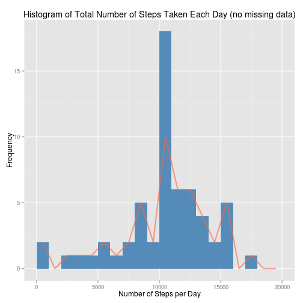
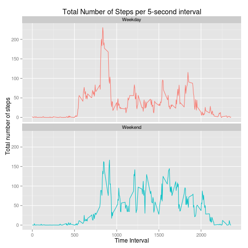

## Loading and preprocessing the data

Show any code that is needed to

1. Load the data (i.e. read.csv())

*The code below loads the datafile into a dataframe and removes NA values*

2. Process/transform the data (if necessary) into a format suitable for your analysis


```r
xo <- read.csv("./data/activity.csv")
x <- na.omit(xo)
```

## What is mean total number of steps taken per day?

For this part of the assignment, you can ignore the missing values in the dataset.

1. Calculate the total number of steps taken per day

```r
sdsum  <- aggregate(x$steps,list(x$date), sum)
```

2. If you do not understand the difference between a histogram and a barplot, research the difference between them. Make a histogram of the total number of steps taken each day

```r
library(ggplot2)
ggplot(sdsum, aes(x=x)) + 
    geom_histogram(fill = "tomato", breaks=seq(0,20000,by=1000)) + 
    ylim(0,18) +
    labs(title = "Histogram of Total Number of Steps Taken Each Day", x = "Number of Steps per Day", y = "Frequency")
```

 

3. Calculate and report the mean and median of the total number of steps taken per day

```r
mean(sdsum$x)
```

```
## [1] 10766.19
```

```r
median(sdsum$x)
```

```
## [1] 10765
```

## What is the average daily activity pattern?

1. Make a time series plot (i.e. type = "l") of the 5-minute interval (x-axis) and the average number of steps taken, averaged across all days (y-axis)


```r
intmean <- aggregate(x$steps,list(x$interval), mean)
ggplot(intmean, aes(x=Group.1, y=x)) + 
    geom_line(col="steelblue") +
    labs(title = "Time Series Plot of the 5-minute Interval", x = "5-minute intervals", y = "Average Number of Steps Taken")
```

 

2. Which 5-minute interval, on average across all the days in the dataset, contains the maximum number of steps?


```r
intmean[intmean$x == max(intmean$x), ]
```

```
##     Group.1        x
## 104     835 206.1698
```

## Imputing missing values

Note that there are a number of days/intervals where there are missing values (coded as NA). The presence of missing days may introduce bias into some calculations or summaries of the data.

1. Calculate and report the total number of missing values in the dataset (i.e. the total number of rows with NAs)

```r
sum(is.na(xo))
```

```
## [1] 2304
```

2. Devise a strategy for filling in all of the missing values in the dataset. The strategy does not need to be sophisticated. For example, you could use the mean/median for that day, or the mean for that 5-minute interval, etc.


```r
# The following code on item 3. will create a new dataset "xofill" and replace the NA by the average numbers of steps for the same 5-minute interval calculated from other days where data was available
```


3. Create a new dataset that is equal to the original dataset but with the missing data filled in.

```r
fillna <- function(steps,interval) {
    if (is.na(steps)) { intmean[intmean$Group.1 == interval, 2] }
    else { steps }
}
xofill <- xo
xofill$steps <- mapply(fillna, steps=xo$steps, interval=xo$interval)
```

4. Make a histogram of the total number of steps taken each day and Calculate and report the mean and median total number of steps taken per day. Do these values differ from the estimates from the first part of the assignment? What is the impact of imputing missing data on the estimates of the total daily number of steps?


```r
xofillsum <- aggregate(xofill$steps,list(xofill$date), sum)
ggplot(xofillsum, aes(x=x)) + 
    geom_histogram(fill = "steelblue", alpha=0.9, breaks=seq(0,20000,by=1000), width=0.5) + 
    geom_freqpoly(data=sdsum,aes(x=x),color="tomato",alpha=0.6, lwd=1, breaks=seq(0,20000,by=1000)) +
    ylim(0,18) +
    labs(title = "Histogram of Total Number of Steps Taken Each Day (no missing data)", x = "Number of Steps per Day", y = "Frequency")
```

 

```r
# Means of filled and original data, respectivelly.
mean(xofillsum$x)
```

```
## [1] 10766.19
```

```r
mean(sdsum$x)
```

```
## [1] 10766.19
```

```r
# Median of filled and original data, respectivelly.
median(xofillsum$x)
```

```
## [1] 10766.19
```

```r
median(sdsum$x)
```

```
## [1] 10765
```

## Are there differences in activity patterns between weekdays and weekends?

For this part the weekdays() function may be of some help here. Use the dataset with the filled-in missing values for this part.

1. Create a new factor variable in the dataset with two levels – “weekday” and “weekend” indicating whether a given date is a weekday or weekend day.

```r
x$day <- weekdays(as.Date(x$date))
x$weekday <- ifelse(x$day == "Saturday" | x$day == "Sunday","Weekend","Weekday")
```


2. Make a panel plot containing a time series plot (i.e. type = "l") of the 5-minute interval (x-axis) and the average number of steps taken, averaged across all weekday days or weekend days (y-axis). See the README file in the GitHub repository to see an example of what this plot should look like using simulated data.


```r
alt <- aggregate(x$steps,list(x$interval, x$weekday), mean)
weekmean <- aggregate(alt$x,list(alt$Group.2),mean)
ggplot(alt, aes(x=Group.1,y=x)) +
    geom_line(aes(col=alt$Group.2)) + 
    facet_wrap(~Group.2, nrow=2) +
    labs(title = "Total Number of Steps per 5-second interval", x = "Time Interval", y = "Total number of steps") +
    theme(legend.position="none")
```

 
